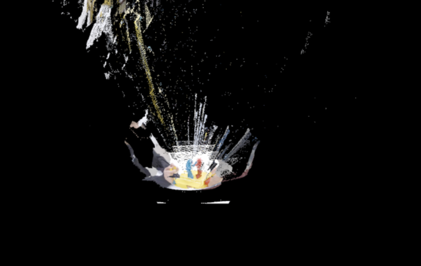

(i accidentally uploaded my key and secret but dont worry its revoked!)
# STREAM3D - Volumetric Web Renderer

STREAM3D is a web-based point cloud renderer built with **THREE.js** and **LiveKit** for **real-time 3D streaming**. It provides a smooth and intuitive interface for visualizing a live depth stream, optionally over a `.xyz` environment model.

<i>Live point cloud streaming from a depth camera (Azure Kinect), rendered on STREAM3D</i>

---

## 🧭 Table of Contents

- [Overview](#-overview)
- [Features](#-features)
- [Configuration](#-configuration)
- [Setup Instructions](#-setup-instructions)

---

## 📌 Overview

STREAM3D harnesses the power of **WebGL via THREE.js** to render 3D point clouds from live depth data while also supporting the loading of static `.xyz` environment scans.

💡 **Access deployed project [here](https://stream3d.netlify.app/)** 
---

## 🚀 Features

- ✅ **Live Point Cloud Streaming**  
  Streams packed depth images via LiveKit and reconstructs them into 3D.

- 🗂️ **Environment Model Support**  
  Upload `.xyz` point cloud models and view them in the same scene.

- 🎮 **Interactive Control**  
  Position, rotate, and scale live stream data in real time.

- 🧭 **Navigation Options**  
  Use OrbitControls (mouse drag) or WASD keyboard navigation.

- 🔐 **On-the-Fly Credentials**  
  Enter your LiveKit URL, API Key & Secret, and room/identity right in the control panel, no config file editing needed.

---

## 🔧 Configuration

### 1. All LiveKit credentials are entered at runtime via the in-app control panel.

### 2. LiveKit URL – e.g. wss://your-server.livekit.cloud

### 3. API Key & API Secret – provided by your LiveKit account

### 4. Room Name – the name of the session/room to join

### 5. Participant Name – your identity in the room
