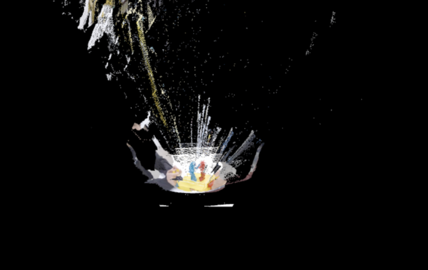

# STREAM3D - Volumetric Web Renderer

STREAM3D is a web-based point cloud renderer built with **THREE.js** and **LiveKit** for **real-time 3D streaming**. It provides a smooth and intuitive interface for visualizing a live depth stream, optionally over a `.xyz` environment model.



<sub><i>Live point cloud streaming from a depth camera (Azure Kinect), rendered on STREAM3D</i></sub>

---

## 🧭 Table of Contents

- [Overview](#-overview)
- [Features](#-features)
- [Configuration](#-configuration)
- [Setup Instructions](#-setup-instructions)

---

## 📌 Overview

STREAM3D harnesses the power of **WebGL via THREE.js** to render 3D point clouds from live depth data while also supporting the loading of static `.xyz` environment scans.

💡 **Use Case:** Perfect for digital twins, AR/VR applications, or real-time 3D reconstruction on the web.

---

## 🚀 Features

- ✅ **Live Point Cloud Streaming**  
  Streams packed depth images via LiveKit and reconstructs them into 3D.

- 🗂️ **Environment Model Support**  
  Upload `.xyz` point cloud models and view them in the same scene.

- 🎮 **Interactive Control**  
  Position, rotate, and scale live stream data in real time.

- 🧭 **Navigation Options**  
  Use OrbitControls (mouse drag) or WASD keyboard navigation.

- 🛠️ **Plug-and-Play Config**  
  Switch LiveKit servers or update credentials through `config.js`.

---

## ⚙️ Installation

Clone the repo and set up your environment:

```bash
git clone https://github.com/sunyentan/3d-web-streamer.git
cd 3d-web-streamer
```

💻 No heavy setup needed, it works right in your browser.

---

## 🔧 Configuration

Update the credentials in your `config.js`:

```bash
// config.js
export const LIVEKIT_URL = "wss://your-server.livekit.cloud";
export const TOKEN = "YOUR_GENERATED_TOKEN_HERE";
```

🛑 Warning: If `config.js` contains secrets, remember to add it to `.gitignore`.

---

## 📦 Setup Instructions

### 1. Clone the Repository

```bash
git clone https://github.com/sunyentan/3d-web-streamer.git
cd 3d-web-streamer
```

### 2. Set Up Your Sender

Instructions coming soon...

### 3. Install Requirements

For development:

```bash
npm install
```

### 4. Generate a Receiver Token

Run the script located at:

```bash
public/tg-receiver.js
```

Then copy the generated token and paste it into `config.js`.

### 5. Run the Project

Simply open `index.html` in a supported browser like Chrome.